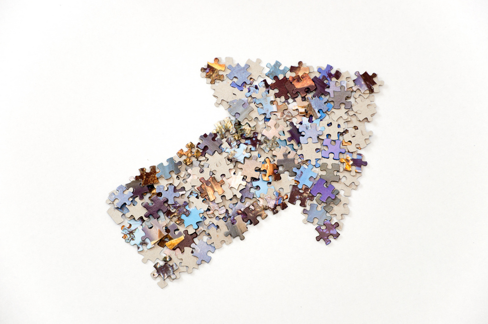

# Actividades de Desarrollo del Proyecto

Planificado el proyecto, llega el momento de ponerlo en funcionamiento.

Imagen: [Horia Varlan](http://www.flickr.com/photos/10361931@N06/4519955517) con licencia CC by 2.0

La **implementación del proyecto** implica el desarrollo de la secuencia de actividades a realizar por el alumnado. En esta fase, además de cumplir con las tareas del profesorado que fueron planificadas anteriormente, el grupo de trabajo debe tener siempre presente la importancia de **documentar el proyecto**. Obteniendo los permisos oportunos, es interesante fotografiar y grabar en vídeo el trabajo del alumnado, independientemente de que el alumnado tenga que archivar en su portafolios aquellos elementos que hayan sido previstos en la planificación. Así mismo, utilizar mecanismos de registro anecdótico de incidentes puede contribuir a la comprensión del desarrollo del proyecto (y a su éxito final).

Por otro lado, gestionar el desarrollo de un proyecto significa mantener un equilibrio razonable entre **seguir el plan establecido** y **dar respuesta a las incidencias** en el desarrollo. No es infrecuente que haya que reajustar el proyecto por razones inevitables y en ese momento es importante tener flexibilidad, imaginación y capacidad para dialogar y negociar. En todo caso, los posibles ajustes que se hagan en el proyecto no deben suponer un compromiso para sus ejes fundamentales: objetivos y criterios de evaluación marcan el camino a seguir a lo largo del proyecto.

Precisamente el **seguimiento** del proyecto permite ir tomando el pulso a su desarrollo. A través de reuniones periódicas los participantes en el proyecto valoran si se está cumpliendo la planificación, si se están alcanzando los hitos y si ha surgido o se prevé alguna dificultad. Así, por ejemplo, en el siguiente vídeo del [Proyecto FGL](http://lorcaenlosmilagros.blogspot.com.es/) puedes ver la reflexión de los estudiantes participantes en relación con el seguimiento que se hizo del proyecto a través de evaluaciones diarias por medio de diarios de aprendizaje:

https//www.youtube.com/watch?v=PMJ6nAdQkRQ?rel=0