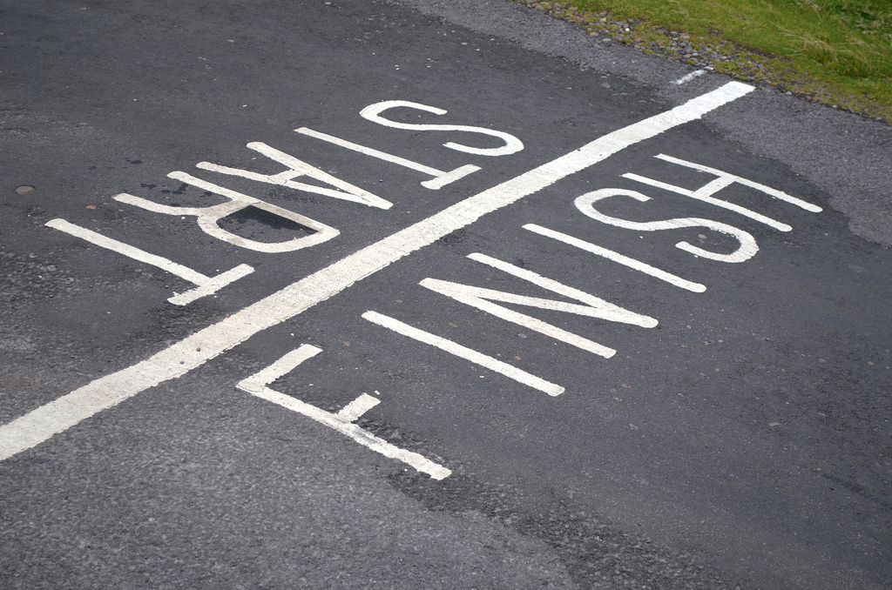

# Actividades de Finalización del Proyecto

Acaba el proyecto y llega el momento de cerrarlo adecuadamente. Para ello se plantean una secuencia en tres fases: cierre, registro y difusión.

Imagen: [Andrew_D_Hurley](http://www.flickr.com/photos/15717926@N04/6254409229) con licencia CC by sa 2.0

El **cierre del proyecto** implica tres cuestiones diferenciadas: en primer lugar, la evaluación del aprendizaje del alumnado; en segundo lugar, la evaluación del proyecto; y, en tercer lugar, la celebración del final del trabajo. Evidentemente las dos evaluaciones a realizar deben haber sido previstas desde el principio del proyecto y llega ahora el momento de recapitular, analizar tanto el proceso como el producto y valorar si se han cumplido los objetivos. A modo de ejemplo, en los dos vídeos siguientes puedes ver la valoración de dos de los docentes implicados en el [Proyecto FGL](http://lorcaenlosmilagros.blogspot.com.es/). En primer lugar, podemos ver a la profesora Clara Benítez, del departamento de Lengua Castellana y Literatura, que valora no sólo el desarrollo del proyecto sino cómo éste ha contribuido a que los estudiantes conozcan en profundidad la vida y la obra de Federico García Lorca:

 

https//www.youtube.com/watch?v=bC1kqSBOCHs?rel=0
[Vídeo (YouTube) - Prof. Lengua y Literatura (Leer.es) - (07:38)](https://www.youtube.com/watch?v=bC1kqSBOCHs)

Y en segundo lugar podemos ver al profesor Juan Antonio Álvarez, del departamento de Ciencias Sociales, Geografía e Historia, que hace una interesante reflexión sobre el valor del Aprendizaje basado en Proyectos:

 

https//www.youtube.com/watch?v=VtxSiurDWfc?rel=0
[Vídeo (YouTube) - Prof. Historia y Geografía (Leer.es) - (05:59)](https://www.youtube.com/watch?v=VtxSiurDWfc)

Por último, acabar el proyecto con una celebración permite afianzar lazos para el siguiente reto y entender que aprender es una actividad gozosa en la cual también podemos disfrutar.

Tras el cierre (o en paralelo) comienzan dos fases importantes. El **registro del proyecto** consiste en archivar toda la documentación que se haya generado en el transcurso del proyecto: planes y programaciones, diseño de actividades, fichas de trabajo, grabaciones y fotografías, evidencias del producto final, etc. Este registro permite no sólo profundizar en la evaluación del proyecto sino también poder replicarlo en cursos sucesivos o en diferentes etapas o niveles.

Para la inclusión del nuevo material en el **histórico de proyectos del centro** es interesante establecer algunos datos fundamentales en una ficha de proyecto: título del proyecto, breve descripción con mención explícita del producto final, materias implicadas, nombre del profesorado, secuencia de actividades, incidencias y valoración general del proyecto.

Por último, tras todo el esfuerzo realizado, aún queda una última responsabilidad del proyecto: **su difusión**. Un proyecto no es una **aventura discreta**. Tenemos la obligación de dar difusión a nuestros proyectos y esta obligación la hemos asumido ante cuatro colectivos importantes: nuestro alumnado, nuestro profesorado, la comunidad profesional y, por supuesto, nosotras y nosotros mismos.

## ¿Por qué es necesario difundir el proyecto?

¿Qué ventajas reporta difundir el proyecto?¿Cómo podemos hacerlo?¿Cómo lo has hecho tú en los proyectos que has realizado anteriormente?

<input type="button" name="toggle-feedback-9" value="Mostrar retroalimentación" class="feedbackbutton" onclick="$exe.toggleFeedback(this,true);return false" />

### Retroalimentación

Tenemos la responsabilidad de difundir nuestro proyecto porque esto beneficia a:

- nuestro alumnado, que se motivará para retos futuros al ver que realmente damos importancia al proyecto y su trabajo;
- las familias, que pueden conocer de primera mano el trabajo que se hace en el centro con sus hijos e hijas;
- el profesorado del centro, que refuerza su capacidad profesional para afrontar retos importantes y cuyo estatus mejora como consecuencia de haber participado en el proyecto que ahora se da a conocer;
- el centro educativo, cuyo nombre se asocia a un proyecto exitoso y le puede permitir encontrar apoyos y recursos para objetivos posteriores;
- toda la comunidad educativa, que aprende de nuestro proyecto, incorporándolo al acervo común con la posibilidad de replicarlo o adaptarlo a la idiosincrasia de cada centro educativo.

Aunque  los medios de comunicación locales siguen siendo una vía insustituible para la difusión de los proyectos realizados por un centro educativo, para difundirlo hoy tenemos en la Red el espacio ideal. Crear una web del proyecto con todos los materiales y las evidencias y difundir la web a través de las redes sociales es un primer paso interesante; mira qué vivo está el **hashtag** #ABP en Twitter:

[Tweets sobre #ABP](https://twitter.com/hashtag/ABP)

Puedes también escribir sobre ella en blogs o sitios especializados, lo cual permite darlo a conocer a un amplio foro de profesionales y personas interesadas en la educación. Existen, por ejemplo, grupos muy interesantes en las redes sociales donde puedes compartir tu trabajo y difundir vuestro proyecto. Un ejemplo es [Proyéctate](http://proyectate.ning.com/):

<iframe width="550" height="400" src="http://prezi.com/embed/yyqt3ybacpzz/?bgcolor=ffffff&amp;lock_to_path=0&amp;autoplay=no&amp;autohide_ctrls=0" frameborder="0"></iframe>

Por último, tampoco deberíamos olvidar presentar nuestro proyecto a algún premio educativo para poder tener así una valoración (e incluso un reconocimiento) externo. La [Red de Buenas PrácTICas 2.0](http://recursostic.educacion.es/buenaspracticas20/web/) es un buen ejemplo de reconocimiento de proyectos de aprendizaje y los [Premios Europeos eTwinning](http://www.etwinning.es/es/inicio/ultimas-noticias/677-convocatoria-de-premios-europeos-etwinning-2013) son uno de los muchos premios donde puedes presentar tu proyecto.
