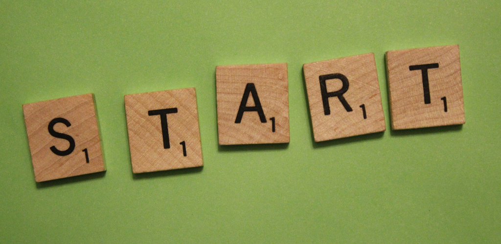

# Actividades de Inicio del Proyecto

Una buena preparación previa del proyecto representa una alta probabilidad de éxito y hay tres cuestiones fundamentales previas a la puesta en marcha del proyecto: pre-diseño, búsqueda de apoyos y recursos y planificación.

Imagen: [jakeandlindsay](http://www.flickr.com/photos/jakeandlindsay/5524669257/) con licencia CC by 2.0

La primera cuestión es el **pre-diseño del proyecto**:

- Los objetivos del proyecto, tomados de aquellas materias o áreas de conocimiento implicadas en el proyecto
- El reto, la pregunta o el problema a resolver
- El producto final que se espera obtener 
- Los criterios y mecanismos de evaluación posibles.

Como ya dijimos en el primer módulo, partir para esta primera fase de los criterios de evaluación de las materias o áreas implicadas abre la vía no sólo a la manera de relacionar el proyecto con el currículo sino también a cómo vincular las distintas materias del currículo escolar.

Este trabajo, analítico y creativo, puede ser realizado de manera sucinta por la persona que coordine el proyecto o puede ser desarrollado, preferentemente, por el equipo de trabajo que vaya a desarrollar el proyecto. En todo caso, en esta primera fase el resultado de esta actividad debe ser recogido en un documento mínimo que pueda ser presentado al equipo directivo, al claustro, al alumnado o a otros agentes externos pues este documento es el eje de la **búsqueda de apoyos y recursos**.

Contar con los apoyos necesarios en el equipo directivo, el claustro, el alumnado, las familias y la comunidad es importante para el desarrollo de un proyecto. No es infrecuente que los proyectos requieran la revisión de los horarios de manera puntual (labor del equipo directivo), la cooperación de estudiantes de cursos superiores o inferiores (con ayuda de compañeros y compañeras del claustro), la obtención de permiso para salidas (familias) o recursos financieros para la compra de material o para sufragar gastos asociados al proyecto (comunidad y agentes externos). Por todo ello, el pre-diseño del proyecto se convierte en un plan de actuación que se puede mostrar para encontrar apoyos y recursos antes de decidir si el proyecto es factible o no.

Si finalmente contamos con los apoyos necesarios, entonces podemos realizar la **planificación detallada del proyecto**. Esta planificación implica que se deben establecer:

- los objetivos del proyecto de aprendizaje,
- la secuencia de actividades que realizarán los estudiantes,
- las tareas a realizar por parte del profesorado para desarrollar el proyecto,
- los productos parciales y el producto final del proyecto,
- el calendario de hitos,
- el listado de recursos,
- los criterios, mecanismos e instrumentos de evaluación,
- la propuesta de difusión.

De todos estos puntos, hay dos aspectos que exigen un comentario más detallado: las tareas del profesorado y el calendario de hitos.

En primer lugar, no se deben confundir la secuencia de actividades **para los estudiantes** y **el listado de tareas **del profesorado****. Si queremos que los estudiantes lean biografías de mujeres científicas, antes es necesario o bien que el profesorado localice esas biografías o, mejor aun, crear una actividad de búsqueda de información en Internet. En todo caso, es interesante organizar el trabajo del profesorado con una tabla como la siguiente:
<td style="text-align: center;">**Fase del proyecto**</td><td style="text-align: center;">** Tarea**</td><td style="text-align: center;">**Productos**</td><td style="text-align: center;">**Participantes**</td><td style="text-align: center;">**Persona responsable **</td>
|**¿En qué momento del proyecto debe el profesorado realizar la tarea?**|**¿Cuál es la tarea a realizar por el profesorado?**|**¿Qué producto se espera como resultado de la tarea?**|**¿Quiénes deben realizar la tarea?**|**¿Quién coordina la realización de esta tarea?**
|Por ejemplo: Fase de búsqueda de información en el proyecto "Granada en la Historia"|Diseñar una caza del tesoro que permita al alumnado localizar y leer información sobre el tema del proyecto.|Caza del tesoro disponible **on-line**|Profesorado de Ciencia Sociales con el apoyo de profesorado de Lengua castellana y Lenguas extranjeras|Coordinador TIC del Centro

Por último, una sencilla manera de realizar el seguimiento del proyecto una vez que esté funcionando y de garantizar el éxito del mismo y del estudiante que participe en él es crear un **calendario de hitos**. En realidad, un calendario de hitos supone simplemente dejar muy claro al alumnado desde el principio cuáles son los **productos parciales** del proyecto y cuándo deben estar finalizados (y cómo serán evaluados). De esta forma el alumnado podrá ir obteniendo resultados parciales que conducirán a la elaboración de un producto final de calidad. Apostamos así por garantizar el éxito de todo el alumnado a través de pequeños logros graduales.
