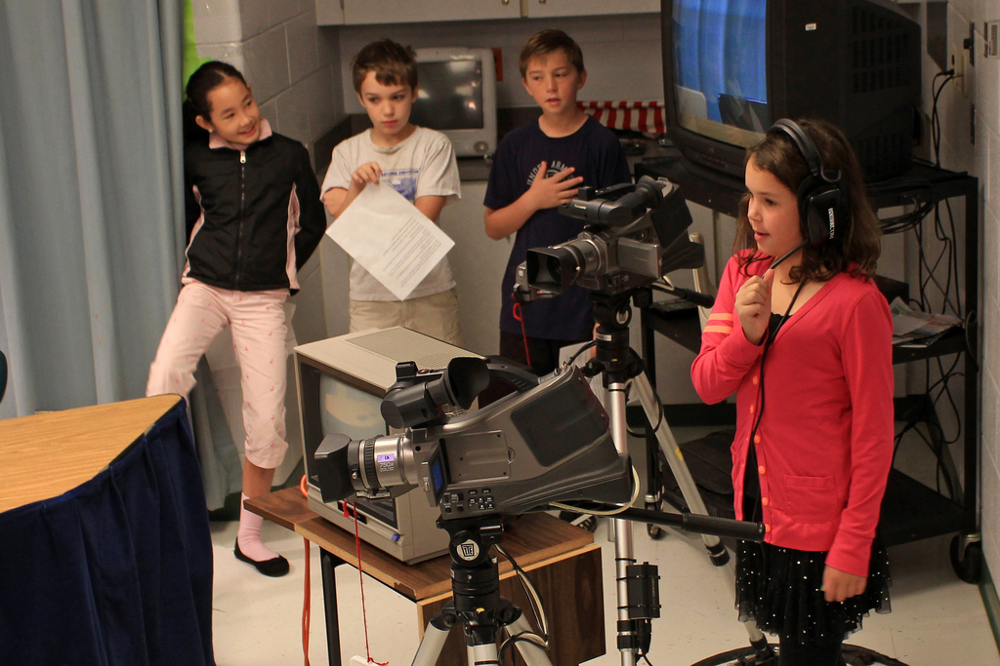

# Cuestiones prácticas

**El diseño de la secuencia de trabajo**

Parece una obviedad pero el diseño de la secuencia de trabajo es fundamental en una situación de aprendizaje cooperativo. Es importante considerar que:

- todos los estudiantes han de tener claro el sentido del proyecto, su desarrollo y su evaluación;
- cada estudiante debe saber exactamente qué debe hacer en cada momento, con quién y dónde;
- todos los miembros del grupo deben mantenerse activos durante el desarrollo del proyecto.

La duda o la inactividad provocan problemas, así que mejor evitarlas.

Imagen: [Woodleywoonderworks](http://www.flickr.com/photos/wwworks/5105427656/) con licencia CC by 2.0

** **

**Composición del grupo**

Un grupo cooperativo es heterogéneo por definición. Se debe considerar para la composición del grupo tanta variedad como haya en el grupo-clase: sexo, origen cultural, lenguas, actitud ante el estudio, resultados académicos, etc.

**Roles**

La mejor manera de hacer realidad el principio de la responsabilidad individual y grupal es asignar roles a los distintos miembros del grupo y, además, hacer que estos roles sean rotativos. Puesto que hemos distinguido entre la tarea académica y el trabajo en equipo, también podemos hacer una distinción entre roles para el desarrollo de la tarea académica (coordinación, secretaría, cronometrado, etc.) y roles para la gestión del trabajo en equipo (normativa, apoyo, crítica, etc.).

**Tamaño del grupo**

Para mantener un nivel y una calidad de comunicación aceptables, el tamaño del grupo no debe superar los siete miembros. Por encima de seis/siete miembros es difícil mantener unas relaciones de trabajo efectivas y el grupo tiende al conflicto y a la fragmentación.

## Una cuestión en relación con el tamaño del grupo

¿Cuál es el tamaño ideal para un grupo cooperativo?¿De qué depende su tamaño?

<input type="button" name="toggle-feedback-19" value="Mostrar retroalimentación" class="feedbackbutton" onclick="$exe.toggleFeedback(this,true);return false" />

### Retroalimentación

El tamaño de un grupo cooperativo depende de dos relaciones:

- cuanto menor sea la experiencia del grupo, menor debe ser su tamaño;
- cuanto más difícil sea la actividad que deben realizar, menor debe ser su tamaño.

Así pues, comienza por parejas cooperativas, pasa después a cuartetos combinando dos parejas y crece finalmente a grupos de seis o siete miembros cuando veas al grupo-clase suficientemente experimentado.
