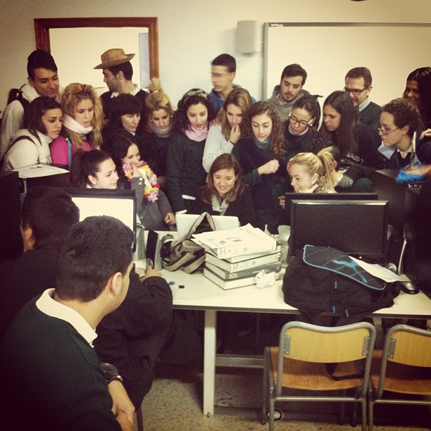

# Educación Secundaria

El Aprendizaje Basado en Proyectos se puede poner en funcionamiento en cualquier etapa del sistema educativo, desde Educación Infantil hasta la Universidad. 

Aprender a través de proyectos en Educación Secundaria y Bachillerato no sólo representa una opción eficaz para la adquisición de conocimientos sino también para la socialización del alumnado, para la integración del currículum y para la atención a la diversidad en contextos complejos. Veamos algunos ejemplos de proyectos. En esta sección puedes conocer algunas prácticas de referencia en Educación Secundaria. ¿Empezamos?

Proyectos transversales

**[El sonido que habito](https://sites.google.com/site/elsonidoquehabito/home)**

El sonido que habito es un proyecto colaborativo multidisciplinar de Mobile Learning, basado en el sonido como fuente de conocimiento. Está abierto a la participación de docentes de cualquier especialidad, de cualquier nivel educativo, de todo tipo de centros y de cualquier parte del mundo, que quieran motivar a su alumnado con el uso didáctico de los dispositivos móviles (smartphones, tabletas, móviles, consolas, etc) y las TIC.

**[Callejeros literarios](https://sites.google.com/site/callejerosliterarios/el-proyecto)**

Esta iniciativa pretende recuperar el sentido perdido de la calle, aportar viveza a la misma, conocer los diversos autores y leer sus textos a través de un “Callejero literario”. El proyecto consiste en una propuesta didáctica que culmina con la creación de un callejero literario de la localidad (creado con Google Maps), que permita realizar con el alumnado, si así lo deseáis, un paseo literario por las calles de vuestro pueblo o ciudad elegida.

**[Leer a tu lado](https://sites.google.com/site/leerasulado/plataforma-edmodo/el-proyecto-en-edmodo)**

Proyecto que gira en torno a las experiencias que surgen a partir de una lectura. Las lecturas se realizan a través de una Red Social por grupos de tres o cuatro alumnos en las que además participa una persona adulta.

**[AporTICs](http://aportics.blogspot.com.es/)**

Proyectos colaborativos centrados en la creación de tutoriales creados por alumnos y alumnas para "Aprender y Compartir". (Primaria y Secundaria)

**[Viaja con nosotr@s](http://viajaconnosotrosa1001lugar.blogspot.com.es/2013/09/proyecto-colaborativo-viaja-con-nosotrs.html)**

Viaja con nosotr@s pretende ser un lugar de encuentro donde sumemos las experiencias y los aprendizajes derivados de los diferentes viajes que podemos realizar desde la escuela a mil y un lugar. Con este proyecto se pretende viajar a través del mundo real, virtual e imaginario. Por supuesto, se busca aprender de los diferentes lugares, tiempos, gentes y culturas. El proyecto no se centra tan sólo en la adquisición de contenidos sino también en desarrollar estrategias, sentimientos y emociones así como estimular capacidades.

Agrupados por áreas

**Lengua castellana y literatura**

- [REDsidencia de Estudiantes](https://sites.google.com/site/redsidenciadeestudiantes/), un proyecto coordinado por [Nacho Gallardo](http://twitter.com/profenacho08) junto a su alumnado de Bachillerato
- [Homenaje a Miguel Hernández: la trastienda de un proyecto colaborativo](http://www.educacontic.es/blog/homenaje-miguel-hernandez-la-trastienda-de-un-proyecto-colaborativo), por [Bloggeando](http://irmadel.wordpress.com/)
- [Callejeros literarios](https://sites.google.com/site/callejerosliterarios/), el proyecto de [A pie de aula](http://apiedeaula.blogspot.com/), [Bloggeando](http://irmadel.wordpress.com/), [Repaso de lengua](http://repasodelengua.blogspot.com/) y [TresTizas](http://trestizas.wordpress.com/)

**Ciencias Sociales**

- [Billete de ida y vuelta](http://billeteidayvuelta.wikispaces.com/home), de Ana Basterra (y [la reflexión que lo sustenta](http://comenzamos.wikispaces.com/home))

**Educación plástica y visual**

- [Una revista digital como proyecto del ámbito artístico](http://www.educacontic.es/blog/una-revista-digital-como-proyecto-del-ambito-artistico), por Lucía Álvarez
- [ARTE-factos](http://creartic.wordpress.com/artefactos/) y [Desastres](http://creartic.wordpress.com/desastres/), dos proyectos de [Daniel Hervás](http://twitter.com/daniel_hervas)

**Educación musical**

- [Mujeres en la música clásica](http://docentes.leer.es/wp-content/uploads/web/index.htm) y [Turismo musical](http://leer.es/recursos/navegar/detalle/-/asset_publisher/3fAFCQK7mwkO/content/turismo-musical-auditorios-y-teatros-de-opera-de-espana-andrea-giraldez;jsessionid=D1D940D3E9ACCFA8B887226DF5F848E0), dos proyectos de [Andrea Giráldez](http://www.bivem.net/)

**Matemáticas y Ciencias**

- [Proyectos de los estudiantes de diversificación dle IES Poeta Julián Andúgar](http://www.educacontic.es/blog/proyectos-de-los-alumnos-de-diversificacion-del-ies-poeta-julian-andugar), por Francisco Muñoz
- [AstroAtocha](http://astroatocha.wikispaces.com/home), el proyecto de guía turística de Madrid tomando como referencia la Astronomía, por [Charo Fernández](http://twitter.com/yalocin)
- A través del **Programa Profundiza**, en los últimos años se han desarrollado un buen número de proyectos del ámbito científico-tecnológico en horario extraescolar. Quizás te gustaría echar un vistazo a la web del programa: [profundiza.org](http://profundiza.org).

[Otros ejemplos de proyectos](http://www.cepazahar.org/recursos/mod/page/view.php?id=5363)
