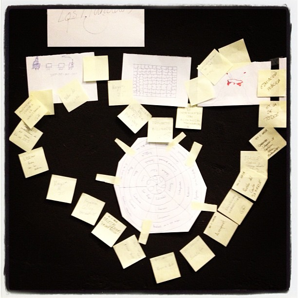

# El ABP como aprendizaje-servicio

## Reflexión

Ya hemos hablado de Aprendizaje-Servicio al describir las posibilidades de Socialización Rica del alumnado dentro del Aprendizaje basado en Proyectos. Sin embargo, si estamos definiendo en esta reflexión el propio ABP como un proceso de aprendizaje del profesorado, ¿podría ser éste también un caso de Aprendizaje-Servicio desde la perspectiva del profesorado?

<input type="button" name="toggle-feedback-22" value="Mostrar retroalimentación" class="feedbackbutton" onclick="$exe.toggleFeedback(this,true);return false" />

### Retroalimentación

Roser Batlle (en Puig, 2009: 80-85) propone cinco características del Aprendizaje-Servicio que pueden ser reveladoras desde la perspectiva del profesorado que diseña y gestiona el ABP:

- El servicio a la comunidad es un trabajo enfocado a los demás.
- El servicio a la comunidad es libre y consciente.
- El servicio a la comunidad es gratuito.
- El servicio a la comunidad requiere reconocimiento y reciprocidad.
- El servicio a la comunidad es significativo y produce satisfacción.

En este sentido, podemos diseñar experiencias de ABP que sean aprendizaje-servicio para el alumnado y para el profesorado, siempre que se cumplan estas características para todos los participantes en la experiencia.

Imagen: Elaboración propia

Una posible tipología de experiencias de Aprendizaje-Servicio puede servirnos para entender la cercanía de ambas propuestas. Según R. Batlle (Puig, 2009: 88-89) podemos encontrar los siguientes tipos de Aprendizaje-Servicio:

- Acompañamiento a la formación: enseñanza de conocimientos y habilidades a otras personas
- Ayuda próxima: apoyo, acompañamiento o ayuda directa a personas con dificultades
- Relación intergeneracional: impulso de proyectos conjuntos entre generaciones de jóvenes y mayores
- Preservación del medio ambiente
- Conservación del patrimonio cultural
- Participación ciudadana
- Solidaridad y cooperación
- Promoción de la salud: difusión de estilos de vida saludables y prevención de riesgos
- Medios de comunicación: campañas de sensibilización, difusión y denuncia para provocar una mejora en el entorno

Así pues, a partir del análisis de la realidad y de la detección de necesidades sobre las cuales podemos intervenir, el Aprendizaje basado en Proyectos y el Aprendizaje-Servicio son dos maneras complementarias de llamar a la misma realidad: el compromiso del profesorado con su entorno y su comunidad.

