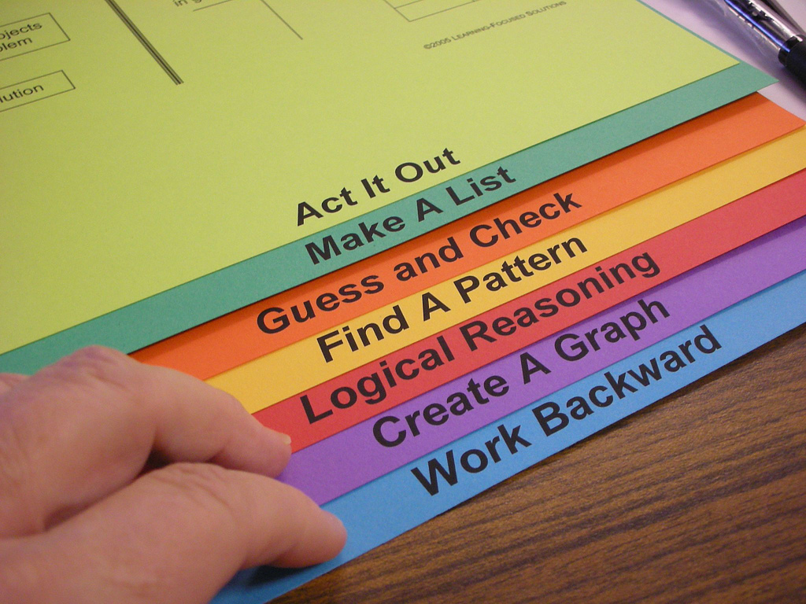

# El ABP como investigación-acción

## Reflexión

La investigación-acción es una de las vías más estimulantes de desarrollo profesional y de investigación educativa. ¿Has tenido alguna experiencia de investigación-acción?¿Conoces alguna experiencia?¿Fue exitosa?

<input type="button" name="toggle-feedback-18" value="Mostrar retroalimentación" class="feedbackbutton" onclick="$exe.toggleFeedback(this,true);return false" />

### Retroalimentación

La [investigación-acción](http://es.wikipedia.org/wiki/Investigaci%C3%B3n-acci%C3%B3n) es una línea de investigación educativa con una amplia tradición nacional e internacional, como demuestran entre otros la [web de recursos de F. Javier Murillo](http://www.uam.es/personal_pdi/stmaria/jmurillo/recursos/inv-accion.htm).

La clave de esta modalidad investigadora es plantear una **acción** en respuesta a un problema y plantear su puesta en práctica con el rigor propio de la investigación científica.

El beneficio de esta manera de organizar el trabajo se puede valorar al menos en dos sentidos: por un lado, por el conocimiento que aporta a los participantes sobre el centro y la dinámica de trabajo; por otro lado, por la posibilidad que abre la investigación-acción de focalizar aspectos concretos del proyecto de aprendizaje que de otro modo podrían quedan ocultos en el trasiego del proyecto.

El [proceso de investigación-acción](http://cvc.cervantes.es/ensenanza/biblioteca_ele/diccio_ele/diccionario/investigacionaccion.htm) corre en paralelo al desarrollo de la secuencia del Aprendizaje basado en Proyectos, como se puede ver en las cinco fases propias de este tipo de trabajo:

- Diagnóstico
- Planificación
- Acción
- Observación
- Reflexión-evaluación

Imagen: [Old Shoe Woman](http://www.flickr.com/photos/83955435@N00/1472422325) con licencia by-nc-sa 2.0

El punto de partida es plantearnos qué queremos investigar y para qué queremos hacerlo. La respuesta a ambas preguntas tiene que estar relacionada con una clara intención de cambio y mejora a través de la acción planteada.

Planificar una investigación supone, entre otras cosas, decidir cómo se realizará la observación en el transcurso de la acción. Para ello hay que escoger las técnicas y procedimientos de recogida de datos más adecuadas para nuestra situación, e incluso decidir si contaremos con la presencia de un investigador externo, si seremos dos docentes en el aula o si no podemos contar con más observadores que el propio docente.

Tras la observación los datos obtenidos han de ser analizados e interpretados, poniéndolos en relación con conocimientos previos generado por las Ciencias de la Educación y con otros contextos educativos. El objetivo concreto de esta etapa es responder a una sencilla pregunta: por qué ocurre lo que ocurre en el aula y cuáles son las consecuencias de lo acontecido en el proyecto. Para ello, además, es interesante que el equipo de trabajo funcione como grupo de discusión y realice una reflexión en profundidad sobre su propia práctica.

Por último, los datos y las conclusiones obtenidas han de ser comunicados a la comunidad o bien a través de la web del proyecto, a través de la Red o participando en encuentros científicos donde el proceso de investigación-acción pueda ser conocido y debatido.

## Conclusión

¿Cuáles son las claves, por tanto, de la investigación-acción?¿No es un proceso complejo que se añade a la ya compleja gestión del Aprendizaje basado en Proyectos?

<input type="button" name="toggle-feedback-20" value="Mostrar retroalimentación" class="feedbackbutton" onclick="$exe.toggleFeedback(this,true);return false" />

### Retroalimentación

No, la investigación-acción no es un **añadido** al Aprendizaje basado en Proyectos. Ambos comparten una secuencia de trabajo similar y se complementan sin añadir una carga de trabajo excesiva al profesorado.

En realidad las dos claves de la investigación-acción son la observación y la reflexión. Si piensas detenidamente cómo observarás el desarrollo de tu proyecto de aprendizaje y después los participantes tienen la oportunidad de reflexionar sobre su actuación, ya estás dando los pasos adecuados hacia la investigación-acción y hacia un propio desarrollo profesional autónomo y de calidad.
