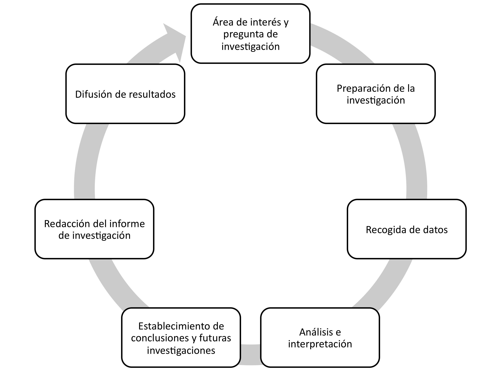

# El ciclo de investigación

Para realizar una investigación de campo debemos comenzar por una **fase de toma de datos** que implica tomar notas, hacer preguntas, buscar información, compartir con el grupo ciertas actividades, etc. En segundo lugar, estas observaciones deben conducir a una **interpretación** de los fenómenos observados. Así pues, se necesita una segunda fase de reflexión cooperativa, en la cual distintos observadores aporten sus visiones sobre el tema. La utilización de múltiples observadores es un elemento interesante pues nos permite reflexionar sobre la diversidad no sólo en el grupo observado sino también en el grupo observador. Finalmente, los estudiantes preparan y difunden su** informe de investigación** en el formato acordado dentro del proyecto.

Imagen: Elaboración propia

 

Así pues, la primera parte del ciclo de trabajo consiste en el contacto con la realidad que vaya a ser investigada. Una vez en el lugar hay que recabar todos los datos que nos sirvan para completar la investigación: cada uno de los estudiantes debe llevar a cabo la responsabilidad que le haya sido asignada, o bien de forma individual o por parejas y grupos que compartan responsabilidades.

Fundamentalmente serán dos tipos de actividades las que puedan realizar los estudiantes:

- Observación directa: toma de muestras, hojas de observación, grabaciones en audio (y quizás en vídeo con la ayuda del profesor), transcripciones, diarios.
- Preguntas: encuestas, entrevistas o cuestionarios.

Con estas actividades deben poder recoger los datos para su investigación.

De vuelta en el centro escolar los estudiantes se reúnen para llevar a cabo el análisis y la interpretación, y preparar la presentación pública, compartiendo la información que antes han recabado.

Es especialmente interesante el análisis interpretativo. En este tipo de análisis el investigador intenta agrupar los datos según categorías. Esas categorías pueden originarse a partir de los datos mismos o pueden pertenecer a alguna teoría y ser aplicadas a los nuevos datos que posee el investigador. El objetivo, en cualquier caso, es buscar elementos comunes, regularidades o patrones que, una vez hallados, se aplican a nuevos datos para ser evaluados. En nuestro ejemplo podemos usar categorías como “personas implicadas”, “lugares implicados”, “actividades realizadas”, “peces”, etc.

Por último, se realiza una exposición pública, que al mismo tiempo sirve de demostración de la finalización de la tarea (para una posible evaluación), de objeto de aprendizaje para otros compañeros (de la misma clase o de otros niveles) y de motivación para futuras experiencias.
