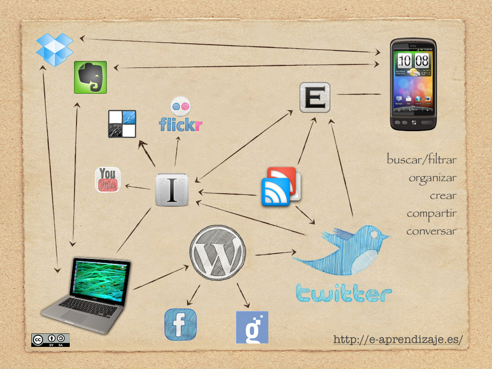

# El PLE al servicio del AbP

## Reflexión

La gestión de proyectos de aprendizaje se ve reforzada si se dispone de un PLE rico y variado. Pero, ¿tienes claro qué es un PLE?

%accordion%Retroalimentación%accordion%

David &Aacute;lvarez ([@balhisay](http://twitter.com/balhisay)) define en su blog [e-aprendizaje](http://e-aprendizaje.es) el PLE o **entorno personal de aprendizaje** como un conjunto de herramientas, servicios y conexiones que facilitan el aprendizaje. Este concepto, fundamental hoy para comprender los procesos de aprendizaje informal (y también los formales, obviamente), puede ser ampliado para comprender el uso que hacemos de la propia tecnología. Así, un docente con un PLE rico y variado utiliza de manera más eficaz y creativa [una herramienta como la PDI](http://www.educacontic.es/blog/una-mirada-la-pdi-desde-el-concepto-de-ple) que otro docente que se limite a saber manejar el software preinstalado en la pizarra.

En el mismo sentido, un docente o un equipo de docentes que dispongan de un PLE bien desarrollado tienen ventaja a la hora de gestionar un proyecto de aprendizaje: las herramientas y los servicios en la red así como las conexiones que la red nos permite hacer nos ayudan a la hora de definir, implementar e incluso evaluar y difundir el proyecto.

%/accordion%

Imagen: [e-aprendizaje](http://www.flickr.com/photos/49807822@N05/6305547278) con licencia CC by-nc-sa 2.0

Para comprender la importancia hoy de tu PLE para la gestión de proyectos de aprendizaje te animamos a que visites, entre otros, el [**Curso para la gestión de tareas y proyectos** de Víctor Cuevas para Aulablog](https://sites.google.com/a/iniciafp.es/gestiontareasyproyectos/). En este curso Víctor Cuevas parte de los principios del GTD y desarrolla un interesante listado de elementos que podrían conformar un PLE adecuado para el Aprendizaje basado en Proyectos:

- [Wunderlist](https://sites.google.com/a/iniciafp.es/gestiontareasyproyectos/curso/tema3)
- [Remember the milk](https://sites.google.com/a/iniciafp.es/gestiontareasyproyectos/curso/tema-4)
- [Gmail y el complemento ActiveInbox](https://sites.google.com/a/iniciafp.es/gestiontareasyproyectos/curso/tema-5)
- [Evernote](https://sites.google.com/a/iniciafp.es/gestiontareasyproyectos/curso/tema-6)
- [Skitch](https://sites.google.com/a/iniciafp.es/gestiontareasyproyectos/curso/tema-7-1)

Por otro lado, también existen herramientas específicas para la gestión de proyectos y de Aprendizaje basado en Proyectos, muchas de ellas [abiertas y gratuitas](http://wwwhatsnew.com/2012/01/22/aplicaciones-open-source-para-la-gestion-de-proyectos/). En la caja de herramientas del curso puedes ver multitud de herramientas online y gratuitas para la gestión de proyectos, échale un vistazo.

En todo caso, cada profesional debe encontrar aquellos recursos que le permitan realizar su trabajo con más eficacia así que esperamos poder conocer bien pronto cómo has configurado tu propio PLE

 
