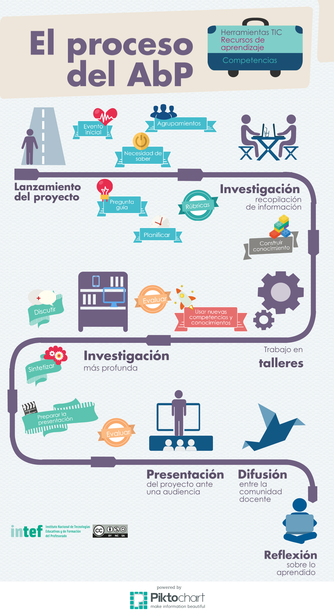

# El proceso del ABP

En la siguiente infografía se muestra el proceso seguido al trabajar mediante ABP. Siempre que se trabaja por proyectos deben tenerse presentes una serie de hitos:

- lanzamiento del proyecto mediante un evento inicial que despierte en los alumnos la necesidad de saber y que genere una pregunta guía que dirigirá el proyecto;
- planificación del proyecto y de su futura evaluación mediante rúbricas;
- investigación y búsqueda de información para contestar la pregunta guía;
- trabajo práctico, en talleres, donde se pongan en práctica y se apliquen los conocimientos y capacidades adquiridos en la fase inicial de investigación;
- evaluación y reflexión sobre lo aprendido a lo largo de todo el proyecto, no sólo al final;
- presentación del producto final generado en el proyecto ante una audiencia y posterior difusión entre la comunidad educactiva;
- reflexión final sobre lo aprendido y sobre el proceso seguido: se trata de una parte imprescindible del proceso si queremos trabajar la competencia de aprender a aprender con nuestro alumnado.

Así mismo, hay una serie de actividades que habrá que realizar a lo largo del proceso para generar un producto final, al tiempo que se produce un aprendizaje efectivo y una reflexión sobre el propio proceso de aprendizaje.

Para este fantástico viaje necesitaremos un completo equipaje:

- [herramientas TIC](http://list.ly/list/Zxa-herramientas-tic-para-abp) para desarrollar las capacidades necesarias en el siglo XXI: crear, evaluar, analizar, colaborar...
- recursos de aprendizaje, es decir, información que nos lleve a adquirir conocimiento
- un guía para hacer ese proceso (es decir, tú, el docente)
- conciencia de que el aprendizaje basado en proyectos no es el postre de las clases magistrales, sino una metodología en la que mientras se hace, se aprende. Así pues, el desarrollo del proyecto debe implicar un diseño muy cuidadoso centrado en los estándares de aprendizaje y las competencias a adquirir.

