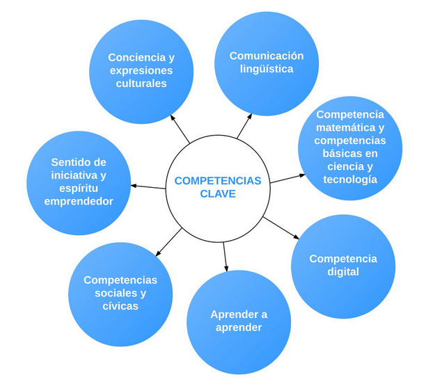
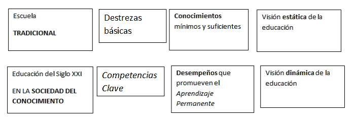
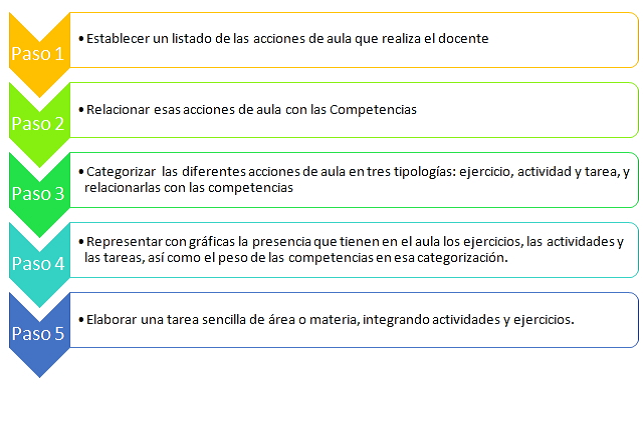
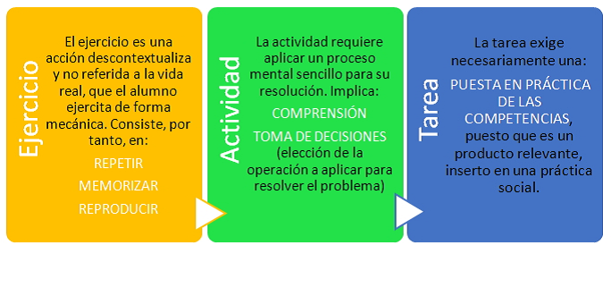

# Estándares de aprendizaje

El producto final de un proyecto puede tener distintos formatos: un folleto, una campaña, una presentación, una investigación científica, una maqueta… Para definir el producto final que han de crear los alumnos deberás tener en cuenta las competencias y estándares de aprendizaje que van a desarrollarse. En las siguientes secciones te explicamos cómo diseñar el proyecto integrando las competencias y los estándares de aprendizaje descritos en la LOMCE.

## Las competencias clave

Las **Competencias Clave** se han convertido en un enfoque determinante para la educación europea en el contexto social contemporáneo. Las orientaciones de la Unión Europea insisten en la necesidad de la adquisición de las competencias clave por parte de la ciudadanía como condición indispensable para lograr que los individuos alcancen un pleno desarrollo personal, social y profesional que se ajuste a las demandas de un mundo globalizado y haga posible el desarrollo económico, vinculado al conocimiento.

Tanto es así que todos los países europeos han reformado sus currículos en la última década para introducir un enfoque basado en los resultados del aprendizaje (Eurydice, 2012).

En nuestro país, la incorporaron explícita de las** Competencias Clave** propuestas por la Unión Europea al sistema educativo no universitario se hace primeramente con la Ley Orgánica de Educación (LOE, 2006) y se ha ratificado en la reciente Ley Orgánica 8/2013, de 9 de diciembre, para la mejora de la calidad (LOMCE). Pero ya desde los años 90 están presentes en nuestro sistema educativo concepciones implícitas de las competencias, si bien entendidas más como capacidades.

La normativa española, a nivel estatal, ha definido siete competencias clave o aprendizajes imprescindibles que  el alumnado debe haber adquirido al finalizar la enseñanza obligatoria. Las competencias clave, que integran tanto los aprendizajes formales incorporados a las diferentes áreas o materias del currículo, como los informales y no formales, son:

El adjetivo ‘clave’ que se aplica a las competencias alude a desempeños que son determinantes para la adquisición de otros más complejos y que implican aprendizajes constantes y nuevas posibilidades de introducir creatividad e innovación en la resolución de problemas. Sin embargo, el adjetivo ‘básicas’ que se usaba junto a las tradicionales ‘destrezas’ representaba la concepción de que una vez adquiridas eran suficientes para el futuro.

**De aprendizajes simples a aprendizajes complejos. De competencias básicas a Competencias Clave.**

Por tanto, lo básico se entiende como algo mínimo y suficiente; y tiene un sentido estático, pedagógicamente hablando, mientras que el adjetivo ‘clave’, que ahora se prefiere aplicar a las competencias, adopta un sentido dinámico, pues implica que son desempeños necesarios – aunque no suficientes – para el desarrollo futuro de nuevos desempeños en la compleja sociedad del siglo XXI.

## ¿Cómo se integran las competencias en el ABP?

Todo buen proyecto debe cumplir dos criterios fundamentales: 

- Debe tener sentido para los alumnos, deben percibirlo como algo que personalmente quieren hacer bien porque les importa.
- Además debe tener un propósito educativo, debe ser significativo, acorde a los estándares de aprendizaje descritos en la LOMCE.

Para ayudar a docentes y centros educativos a integrar las competencias en la vida real del aula, el Centro Nacional de Innovación e Investigación Educativa (CNIIE), del Ministerio de Educación, Cultura y Deporte (MECD) ha elaborado recientemente una**[Guía para la formación en centros sobre las competencias básicas](https://sede.educacion.gob.es/publiventa/detalle.action?cod=16109) **(2013). De acuerdo con esta guía, el procedimiento que se ha de llevar a cabo para la integración de las competencias en el quehacer diario del aula son:

**Pasos para la integración de las competencias en el aula**

## Ejercicio, actividad, tarea y proyecto

Siguiendo la guía del CNIIE (MECD), una tarea consiste en la elaboración de un producto final relevante que permita resolver una situación-problema real en un contexto social, personal, familiar y/o escolar, aplicando contenidos mediante el desarrollo de ejercicios y poniendo en marcha procesos mentales imprescindibles mediante el desarrollo de actividades.

A diferencia del ejercicio y la actividad, el diseño de una tarea requiere decidir para qué se hace esa tarea, qué producto final se va a elaborar vinculado a la vida real y qué relevancia social tiene en el día a día del alumno. Así mismo, para la resolución de la misma no hay una respuesta prefijada – como ocurre con el ejercicio, que es mecánico, repetitivo y memorístico –, sino que va más allá. En la siguiente presentación puedes ver cómo encajan ejercicios, actividades y proyecto.

<iframe width="425" height="355" style="border: 1px solid #cccccc; margin-bottom: 5px; max-width: 100%; display: block; margin-left: auto; margin-right: auto;" src="//www.slideshare.net/slideshow/embed_code/44695702" frameborder="0" marginwidth="0" marginheight="0" scrolling="no" allowfullscreen=""></iframe>

Como ves, un proyecto encaja perfectamente en la definición de **tarea integrada** de la LOMCE. En la siguiente presentación puedes ver unas pautas para diseñarlo de forma que cumpla con los dos criterios fundamentales del ABP:

<iframe width="425" height="355" style="border: 1px solid #CCC; border-width: 1px; margin-bottom: 5px; max-width: 100%;" src="//www.slideshare.net/slideshow/embed_code/44258426" frameborder="0" marginwidth="0" marginheight="0" scrolling="no" allowfullscreen=""></iframe>

