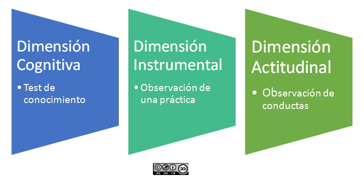
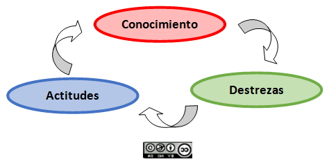

# Evaluar competencias es evaluar los desempeños y sus dimensiones

Si dijimos que las competencias se materializan en desempeños (ejecuciones concretas y observables), la educación basada en competencias debe realizar su evaluación mediante la evaluación de los desempeños a que cada competencia da lugar.

Así, las competencias se manifiestan por medio de las acciones o tareas que realiza el alumno en una situación o contexto determinado (desempeño de la competencia). Esta concepción de las competencias permite relacionarlas y diferenciarlas en tanto que se traducen en desempeños observables.

La observación y constatación de la ejecución de tales acciones (el desempeño) es lo que debe ser valorado en la evaluación de la competencia con arreglo a una serie de indicadores, que conforman los criterios de evaluación.

Evaluar por competencias supone diseñar instrumentos en los que el estudiante demuestre con desempeños (evidencias) que puede realizar las tareas de la competencia exigida.

Pero como ya explicamos, eso no siempre es fácil en el contexto escolar. Por ello resulta imprescindible obtener información también  sobre el nivel de adquisición de las competencias a partir de la utilización de técnicas de evaluación y observación basadas en el diseño de indicadores para cada una de las distintas dimensiones (cognitiva, instrumental, y actitudinal) de las competencias. 

 

Imagen 3. *Ejemplos de evaluación y observación de las dimensiones de una competencia (desempeño)*

Al realizar una evaluación de las competencias de este modo, se deben considerar todas las **dimensiones de la competencia**, es decir, los conocimientos que implica, las destrezas que deben desarrollarse y las actitudes del estudiante en relación con esa competencia.

Imagen 4.** Las d***imensiones de una competencia*

