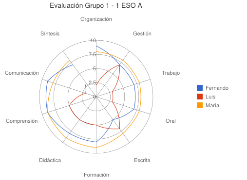

# La diana de evaluación

**Imagen tomada de [Evaluar por competencias con Google Apps](http://blog.princippia.com/2014/08/evaluar-competencias-googleapps.html), Princippia**

La diana es un método de evaluación participativa, rápido y muy visual, que nos permite conocer la opinión de nuestros alumnos sobre diversos aspectos de nuestra actividad o proyecto. Con la evaluación participativa, los alumnos aportan su valoración y la comparten con el resto de sus compañeros.

<iframe width="427" height="356" src="http://www.slideshare.net/slideshow/embed_code/11042952" frameborder="0" marginwidth="0" marginheight="0" scrolling="no" allowfullscreen=""></iframe>

[SlideShare](https://www.slideshare.net/fqmanuel/evaluacin-participativa-la-dian). [**Presentación acerca de "Evaluación participativa: la diana"** from **Manuel Diaz**](http://www.slideshare.net/fqmanuel/evaluacin-participativa-la-diana?ref=http://127.0.0.1:51237/AbP_2015_04_21_B3_t2_mecanismoseva/authoring) 

Un ejemplo del uso de la diana en Infantil podría ser:

**Objetivo**: Evaluar de manera cuantitativa diferentes aspectos de la actividad.

**Desarrollo**: En una cartulina, papel o en la pizarra dibujamos una diana y la dividimos en tantos espacios como aspectos queramos evaluar. Cada persona señalará con un punto cada uno de los aspectos, teniendo en cuenta que cuanto más próximo a la diana se sitúe mejor será la puntuación.

Una vez completado por todos, hacemos una asamblea de evaluación. 

[Descargar plantilla](https://drive.google.com/folderview?id=0B8om3rWfjmRnenZ6ZXJkWlNlYjQ&amp;usp=sharing) de [Taller de evaluación](http://yalocin.wix.com/evaluacion) de Charo Fernández y Jorge Gómez.

En el artículo [Evaluar por competencias con Google Apps](http://blog.princippia.com/2014/08/evaluar-competencias-googleapps.html), del blog Princippia, puedes ver un ejemplo para 1º ESO usando los formularios de Google para crear la diana. Otra herramienta útil es [Online ChartTool](http://www.onlinecharttool.com/). Hay que elegir la opción "radar" que es como se conoce este tipo de gráfico en el campo de la visualización de datos. También conviene ajustar los ejes manualmente. 
