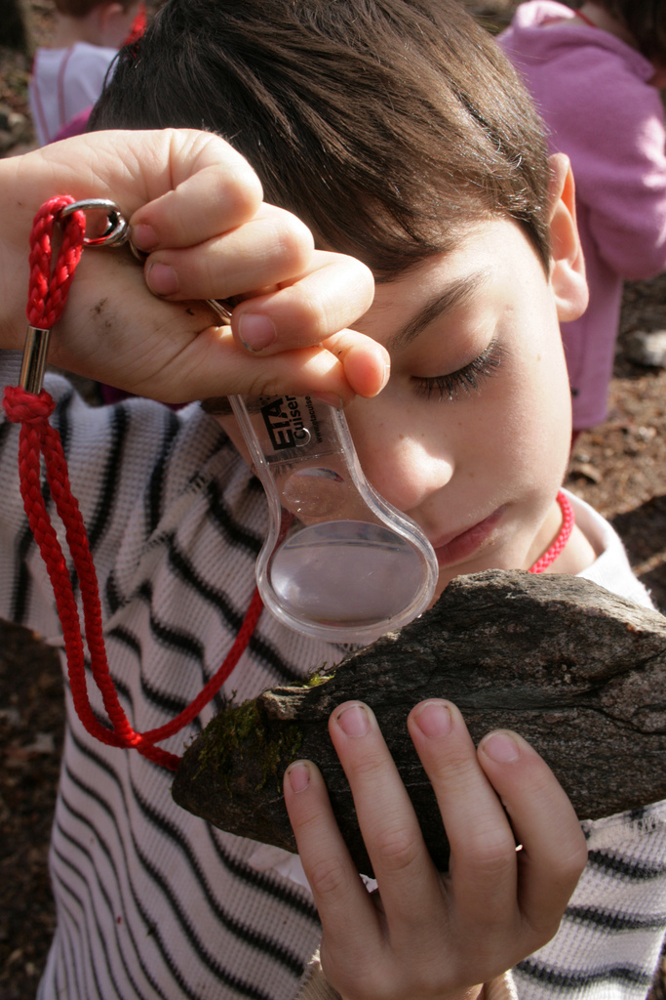

# La investigación de campo

Por investigación de campo entendemos el estudio detallado de algún aspecto de la realidad en su propio entorno. Podríamos distinguir la investigación naturalista, que analiza elementos de la naturaleza, y la investigación etnográfica, que observa la vida de un grupo de individuos en su contexto.

Imagen: [Woodleywonderworks](http://www.flickr.com/photos/wwworks/4121133646/in/photostream/) con licencia CC by 2.0

Cuando la investigación se realiza desde el aula quiere decir que son los estudiantes los que asumen el rol del investigador. Los estudiantes, agrupados en estructuras de aprendizaje cooperativo, desarrollan una investigación relacionada con los contenidos de las áreas curriculares. Para ello pueden interesarse por la comunidad escolar, por su entorno (barrio) o por elementos más lejanos (centros de trabajo como una fábrica o una lonja pueden ser objeto de estudio).

## Reflexión

¿Has participado alguna vez en un proyecto de investigación?¿Has propuesto a tu alumnado alguna vez un proyecto de investigación?¿Conoces alguna experiencia de proyectos de investigación en el aula?¿Fue exitosa la experiencia?¿Por qué?

%accordion%Retroalimentación%accordion%

En la web del Programa Profundiza ([http://profundiza.org](http://profundiza.org)) puedes ver una gran variedad de proyectos de investigación tanto en Educación Primaria como en Educación Secundaria. Muchos de ellos tienen "diarios de proyecto" que te pueden servir para**profundizar** en su conocimiento.

%/accordion%