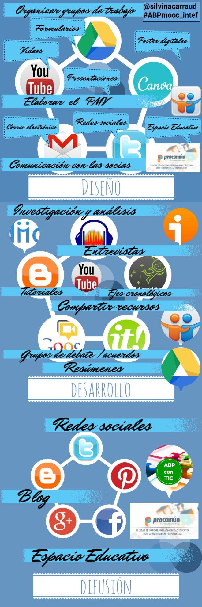

# Las TIC en el AbP

A lo largo de este curso hemos ido viendo, tanto en contenidos como actividades, numerosas herramientas que potencian la metodología colaborativa. Puedes ver esas herramientas, agrupadas por funcionalidad (para gestionar recursos, para comunicarse, para gestión de proyecto, para crear colaborativamente) en la caja de herramientas, échale un vistazo. Pero antes, nos gustaría que reflexionaras sobre el porqué y el cómo del uso de las TIC en el aula. 

Por sí mismas no aportan nada si solo sirven para adornar lo que hacemos sin ellas. O si la tarea en sí es una justificación para usar la herramienta y no al revés.

https//www.youtube.com/watch?v=MNXippCWVr4?rel=0
**Vídeo creado para el MOOC sobre ABP del INTEF, 2014.**

Las Tecnologías de la Información y la Comunicación (TIC) juegan un papel fundamental en cualquier proyecto de aprendizaje. Tanto en cualquiera de las fases del proyecto como en relación con cualquier tipo de proyectos, las TIC, como en nuestra vida, pueden aportar y servir de ayuda para el alumnado.

Sin embargo, en relación con las TIC es interesante mantener el equilibrio entre las necesidades del proyecto y el uso del recurso más sencillo posible. No es la tecnología en sí misma lo que nos interesa (aunque el uso de las TIC incida en la competencia digital propiamente dicha) sin los procesos cognitivos, comunicativos y emocionales que las TIC pueden generar.

En la siguiente infografía de [Silvina Carraud](https://twitter.com/silvinacarraud) se presentan actividades, artefactos digitales y herramientas usadas para el diseño, el desarrollo y la difusión de un proyecto, concretamente del proyecto [Impresion(antes)](https://tackk.com/proyectoimpresionantes) que podéis conocer también en[ el blog del proyecto ](https://sites.google.com/site/proyectoimpresionantes/)

Esta infografía también está disponible en la red [en formato de presentación](https://docs.google.com/presentation/d/1ZsXogbprRSkrl137mV-fiHJYfOYp56o-4hT1rOaEqWc/pub?start=false&amp;loop=false&amp;delayms=3000#slide=id.g3347ea7ce_089) y se [desglosa por fases en este blog](http://pledocente.blogspot.com.es/2014/05/abpmoocintef-abriendo-el-proyecto-las.html)

Una vez que hemos introducido las TIC en nuestro proyecto, es muy conveniente valorar la presencia de las mismas en nuestro proyecto. En el [siguiente post](http://pledocente.blogspot.com.ar/2014/05/abpmoocintef-valorar-la-presencia-de.html) se muestra un ejemplo sobre cómo hacerlo 

