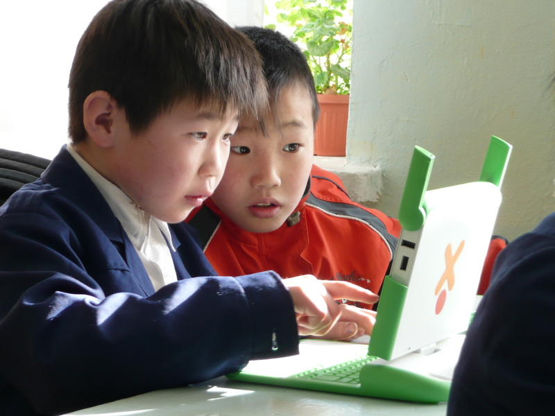

# Movimiento en el aula: aprendizaje cooperativo

El primer movimiento tiene lugar dentro del propio aula y representa el aprendizaje que se genera por la interacción de los propios estudiantes entre sí.

Imagen: [One Laptop per Child](http://www.flickr.com/photos/olpc/2607192336/) con licencia CC by 2.0

Hay tres **estructuras de interacción** posibles en el aula: la **estructura individualista**, la **estructura competitiva** y la **estructura cooperativa**.

En la estructura individualista el resultado de cada estudiante no está relacionado, ni para bien ni para mal, con el trabajo y los resultados del resto del grupo. Aunque ésta es la estructura más frecuente tradicionalmente en nuestro sistema educativo (vinculada con la "enseñanza directa" que comentamos en el módulo anterior), esta gestión del aula y del trabajo no permite que los estudiantes se beneficien de la interacción entre ellos ni tampoco acometer actividades de cierta complejidad y que requieran trabajo en equipo.

En la estructura competitiva el resultado de cada estudiante está en relación con el resultado del resto del grupo puesto que en esta modalidad cada estudiante lucha por superar a todos los demás. Esta modalidad no sólo desaprovecha al grupo como fuente de aprendizaje sino que introduce en el aula dinámicas que perjudican a la mayoría de los estudiantes emocional y académicamente.

De estas tres estructuras la más eficaz y provechosa es la estructura cooperativa y por eso en este primer movimiento utilizaremos el aprendizaje cooperativo como estrategia de trabajo para nuestros proyectos.
