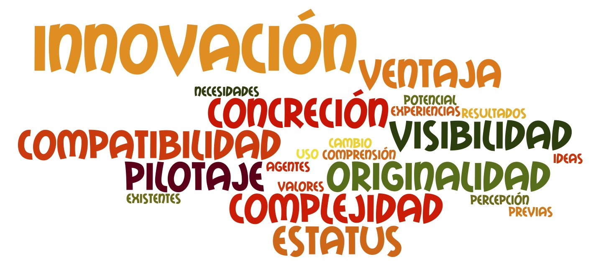

# Prácticas de referencia en ABP

Hay diversos factores que nos permiten prever si una innovación educativa va a tener éxito.

Imagen: elaboración propia

Entre estos factores podemos destacar el nivel de originalidad y concreción y la posibilidad de pilotar la innovación. Una innovación demasiado original, poco concreta o cuyo ensayo represente un problema para el experimentador, dificulta su asimilación; por el contrario, una innovación gradual, factible y **pilotable** en el contexto personal de cada docente es más fácilmente asumible.

Conocer prácticas de referencia en Aprendizaje Basado en Proyectos nos permite valorar su nivel de originalidad y concreción y qué necesitamos para poder pilotar la innovación.

Si tras conocer todas estas experiencias, todavía te asaltan dudas respecto al APB, tales como: "el ABP es sólo hacer cosas", "el ABP no enseña contenidos académicos", "el ABP ocupa demasiado tiempo", "el ABP es sólo para buenos estudiantes" o "el ABP es difícil de manejar o no encaja con mi estilo docente", entonces quizás sea mejor que leas el artículo [Debunking five myths about project-based learning](http://www.edutopia.org/blog/debunking-five-pbl-myths-john-larmer), de John Larmer en [Edutopia](http://www.edutopia.org/).
