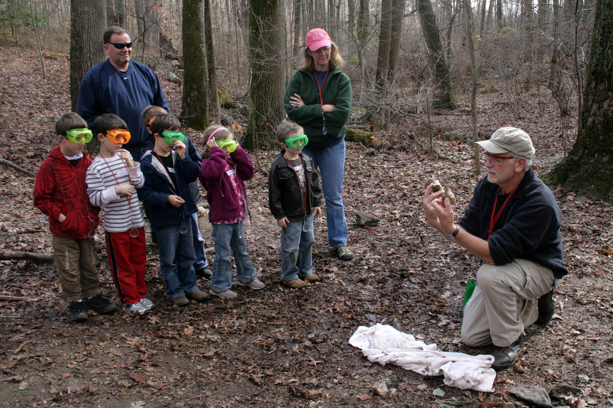

# Requisitos y pasos fundamentales

Imagen: [woodleywonderworks](http://www.flickr.com/photos/wwworks/4121373286/in/photostream/) con licencia CC by 2.0

 

Antes de plantear un proyecto de investigación es interesante plantearse una serie de **requisitos** que condicionarán, en cierta medida, nuestro éxito:

- La investigación tiene que formar parte de un proyecto curricular abierto en el cual el grupo de investigación pueda realmente diseñar preguntas genuinas para encontrar respuestas auténticas
- La práctica reiterada de tareas investigadoras facilita su desarrollo, mientras que su excepcionalidad lo dificulta.
- Es aconsejable ensayar estructuras de aprendizaje cooperativo en actividades más simples antes de embarcarse en un proyecto de investigación: el trabajo cooperativo en parejas o pequeños grupos no es una organización que surja espontánea (sí ha de cumplir con los requisitos del aprendizaje cooperativo antes expuestos), por lo que hay que ir preparándola gradualmente, trabajando primero la cohesión y familiaridad del grupo y, progresivamente, el reparto de responsabilidades.
- El docente ha de llevar a cabo una planificación exhaustiva de la tarea, incluyendo una clara presentación de objetivos y una cuidadosa preparación de la(s) visita(s) de estudio.

Para llevar a cabo este tipo de actividad podríamos considerar **cinco pasos fundamentales**:

1. Determinar un área de interés (ya sea motivado por lecturas, observación, comentarios, etc.); por ejemplo, “la pesca”.
1. Formular una pregunta. La pregunta ha de ser tal que, por un lado, creamos que seremos capaces de responderla y, por otro lado, estimemos que merece la pena estudiarla; por ejemplo, “qué pasa desde que el pescado está en el mar hasta que llega a nuestra mesa”.
1. Refinar y precisar al máximo la pregunta; por ejemplo, “qué personas se ven implicadas desde que el pescado está en el mar hasta que llega a nuestra mesa” y “qué hace cada persona”
1. Definir los datos que te hacen falta para responder a esa pregunta; por ejemplo, “profesiones del mar”, “lugares relacionados con la pesca y la venta de pescado”, etc.
1. Preparar la investigación: qué tipo de recogida de datos, análisis e interpretación son necesarios para responder a mi pregunta; por ejemplo, cuestionarios para los pescadores, hojas de observación para la lonja o la pescadería con los nombres de los peces, etc.

Debemos definir con claridad qué vamos a investigar y qué vamos a producir como resultado (un mural, un informe escrito, una narración, o incluso un reportaje fotográfico); es decir, en la fase preparatoria se organiza la investigación clarificando objetivos, repartiendo responsabilidades, preparando cuestionarios u hojas de observación, así como solucionando cuestiones que podamos encontrar y para las cuales necesitemos algunos conocimientos previos.
