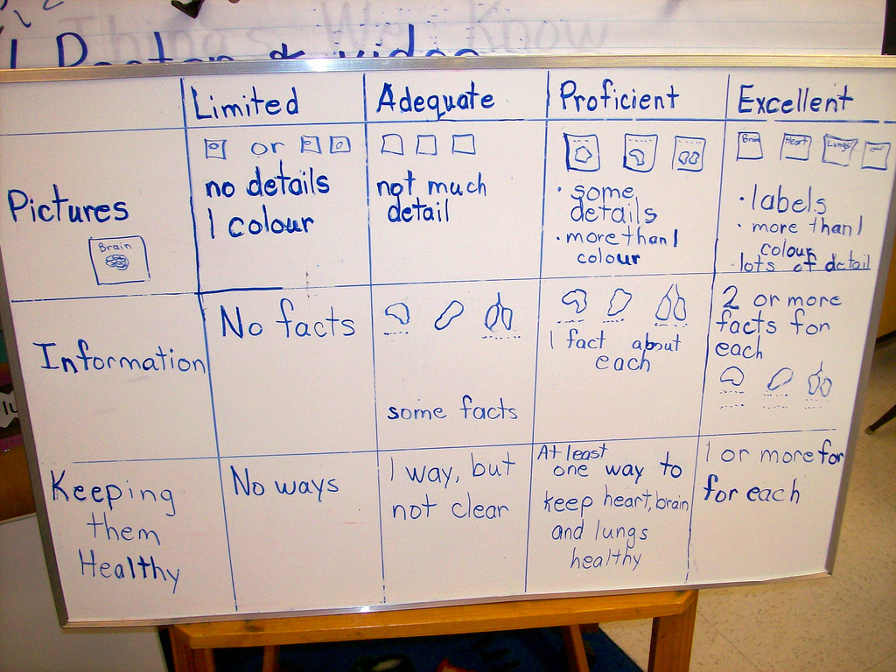

# Rúbricas

Con total seguridad, cuando tú realizas cualquier actividad te gusta saber **a priori** cómo establecer si has tenido éxito o no. Todos, de manera explícita o no, manejamos criterios de evaluación cuando realizamos cualquier actividad.

Imagina ahora una tarea que quieras que realicen tus estudiantes. Esta tarea supone un proceso de trabajo y conlleva la obtención de un producto. Si estableces las categorías que determinan el éxito del proceso y del producto, si ordenas los posibles grados de éxito y redactas unos enunciados que describan esos grados de éxito, entonces ya has hecho la rúbrica para evaluar la tarea.

 

Imagen: [Kath Cassidy](http://www.flickr.com/photos/57634636@N00/6366696839) con licencia CC by-nc-sa 2.0
