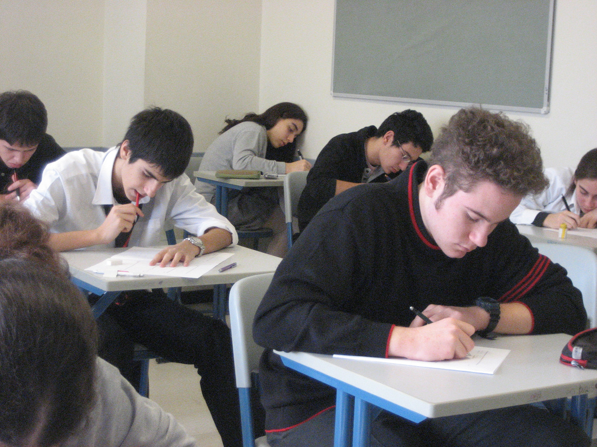

# Una evaluación alternativa para una enseñanza alternativa

Dice Miguel Ángel Santos Guerra, en su libro **Una flecha en la diana: la evaluación como aprendizaje** ([ver artículo resumen](http://multiblog.educacion.navarra.es/jmoreno1/files/2013/10/evaluaci%C3%B3n-de-la-escuela.pdf)): "**La evaluación es un fenómeno educativo que condiciona todo el proceso de enseñanza y aprendizaje. No se trata de un fenómeno esencialmente técnico sino de un fenómeno ético. Por consiguiente, resulta indispensable preguntarse a quién beneficia cuando se hace y a quién perjudica; a qué valores sirve y qué valores destruye. La ****evaluación puede servir para muchas finalidades. Lo importante es utilizarla como aprendizaje, como un modo de comprender para mejorar las prácticas que aborda.**"

Las pregunta es "para qué" evaluamos, ¿qué beneficios perseguimos? No tiene mucho sentido evaluar por evaluar, porque "toca hacerlo". Tiene menos lógica aún y ninguna ética evaluar para jerarquizar, clasificar, atemorizar, perseguir y castigar. Una de las finalidades que debe tener la evaluación es la de perseguir el aprendizaje de evaluados y evaluadores. Por ello, necesitamos unas dinámicas de evaluación que vayan más allá de la mera comprobación de que el alumno ha memorizado unos contenidos.

Enseñanza y evaluación son **las dos caras de una misma moneda**. Entre ambas debe haber una correlación absoluta: nuestra manera de enseñar debe determinar nuestra manera de evaluar porque, de manera inevitable, nuestra manera de evaluar condiciona la manera de aprender de nuestros estudiantes.

Por ello, si nuestro estilo de enseñanza está cerca de la "instrucción directa" que describiremos en el primer módulo y nuestro estilo de evaluación consiste en un examen escrito en el cual solicitamos de nuestros estudiantes que reproduzcan el contenido que nosotros expusimos en la fase de presentación, el mensaje en relación con el estilo de aprendizaje de nuestros estudiantes es bien claro: es necesario memorizar los contenidos y ninguna otra competencia (en inglés podríamos hablar de [**21st Century Skills**](http://www.bie.org/research/21st_century_skills)) es necesaria.

Imagen: [ccarlstead](http://www.flickr.com/photos/cristic/359572656/) con licencia CC by 2.0

Si, por el contrario, tenemos intención de valorar cómo se aprende y qué se aprende durante el desarrollo de nuestro proyecto y al final del mismo, así como la calidad del producto final y otros aspectos que encontremos relevantes (relaciones entre los estudiantes, relaciones dentro del grupo, cambio actitudinal, etc.), entonces tenemos necesidad de buscar mecanismos de evaluación alternativos más allá de las herramientas convencionales: estamos hablando de una evaluación alternativa para una enseñanza alternativa.

¿Para qué evaluamos? 

En primer lugar, porque existe la necesidad de regular el aprendizaje, es decir, de detectar las posibles dificultades que puedan encontrar los estudiantes en su aprendizaje para, a partir de ahí, ayudarles a resolverlas; en segundo lugar, la obligación de informar a estudiantes y familias sobre los resultados de su aprendizaje y su avance a lo largo del curso.

Hablaremos de **evaluación** cuando hagamos referencia al procedimiento de análisis del aprendizaje para su regulación por parte del profesorado y de los propios estudiantes.

En cambio, usaremos el término **calificación** para referirnos al procedimiento de cuantificación y comunicación de los resultados del aprendizaje y su evolución a los estudiantes y sus familias.

Limitar la función evaluadora a la calificación sin implicaciones en la regulación del aprendizaje reduce, por tanto, la fuerza de la evaluación a un acto administrativo pero de importantes consecuencias. Por el contrario, una evaluación de la cual se deriven planes de mejora sí es realmente educativa y el Aprendizaje basado en Proyectos nos permite hacer de la evaluación no una tarea fastidiosa y frustrante sino una manera de valorar cómo podemos aprender más y mejor a través de nuestros proyectos.
